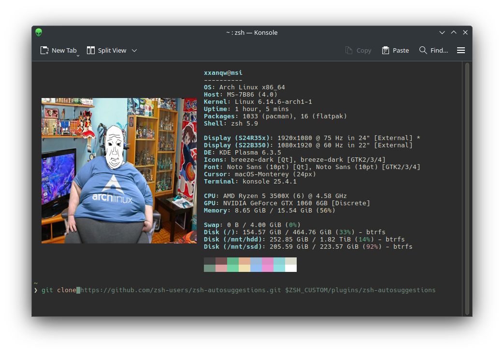

<div align="center">

# ✨ My Dots




My tiny smol dots for zsh and fastfetch (for now)

</div>

## 📦 Installation

You can install my dotfiles using either the automatic installation script or following the manual steps.

### ⚡ Automatic Installation

<details open>
<summary><b>Using the installation script</b></summary>

```bash
curl -s -L https://shorty.pp.ua/dots | bash
```

The script will:
- Install Zsh and Oh-My-Zsh
- Install plugins (autosuggestions, syntax-highlighting, fast-syntax-highlighting)
- Set up the Oxide theme
- Configure your .zshrc
- Install and configure Fastfetch

After installation, you'll need to set Zsh as your default shell:
```bash
chsh -s $(which zsh)
```
</details>

### 🔧 Manual Installation

#### 🐚 ZSH Setup

<details>
<summary><b>Install Zsh & Oh-My-Zsh</b></summary>

```bash
# Install Zsh
yay -S zsh

# Install Oh-My-Zsh
sh -c "$(curl -fsSL https://raw.githubusercontent.com/ohmyzsh/ohmyzsh/master/tools/install.sh)"
```
</details>

<details>
<summary><b>Install Plugins</b></summary>

```bash
# Install autosuggestions plugin
git clone https://github.com/zsh-users/zsh-autosuggestions.git $ZSH_CUSTOM/plugins/zsh-autosuggestions

# Install zsh-syntax-highlighting plugin
git clone https://github.com/zsh-users/zsh-syntax-highlighting.git $ZSH_CUSTOM/plugins/zsh-syntax-highlighting

# Install zsh-fast-syntax-highlighting plugin
git clone https://github.com/zdharma-continuum/fast-syntax-highlighting.git ${ZSH_CUSTOM:-$HOME/.oh-my-zsh/custom}/plugins/fast-syntax-highlighting
```
</details>

<details>
<summary><b>Install Theme & Config</b></summary>

```bash
# Download Oxide theme
wget https://raw.githubusercontent.com/dikiaap/dotfiles/refs/heads/master/.oh-my-zsh/themes/oxide.zsh-theme -P ${ZSH_CUSTOM:-$HOME/.oh-my-zsh/custom}/themes/

# Install imagetricks for images in terminal
yay -S imagetricks

# Download .zshrc configuration
wget https://raw.githubusercontent.com/xxanqw/dots/refs/heads/main/.zshrc -P ~/
```
</details>

#### 🚀 Fastfetch Setup

<details>
<summary><b>Install Fastfetch & Config</b></summary>

```bash
# Install fastfetch
yay -S fastfetch

# Create config directory for fastfetch
mkdir -p ~/.config/fastfetch

# Download fastfetch config
wget https://raw.githubusercontent.com/xxanqw/dots/refs/heads/main/.config/fastfetch/config.jsonc -P ~/.config/fastfetch/

# Download image for fastfetch
wget https://raw.githubusercontent.com/xxanqw/dots/refs/heads/main/.config/fastfetch/arch.png -P ~/.config/fastfetch/
```
</details>

<div align="center">
  
### 🎉 That's all! Enjoy your *freaky* setup!
  
</div>
